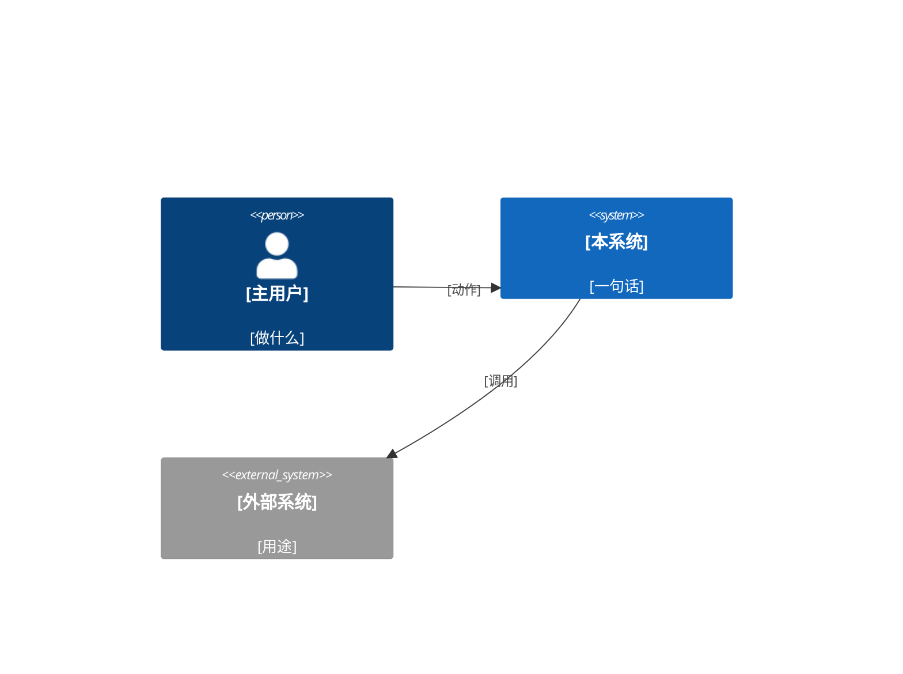
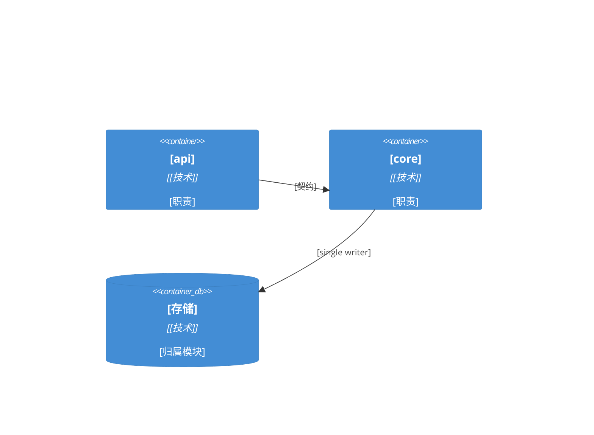
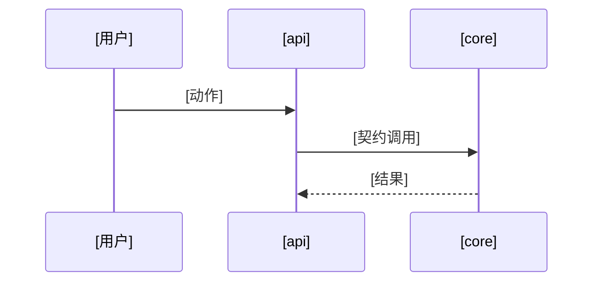

# Architecture Design — {{项目名}}

> 生成：{{日期}} · 档位：{{S/M/L}} · 路：{{Coaching / Fast}} · 状态：待批准
> 本文档只写不变量（两个独立构建的单元会在这上面选得不兼容的决定），其余是种子，代码一出现就归代码。依赖规则与禁边以 `.claude/harness/module-catalog.json` 为机器执行版（L 档）；两处冲突时以 catalog + arch-check 实测为准并回改本文档。
> 段名保持不变（predev-lint 机器检查）：架构概览 / 模块划分 / 依赖规则 / 运行与部署包络 / 关键决策记录；每条 ADR 含 背景 / 决策 / 被拒备选 / 执法方式 / revisit-if / reversal（后三项 adr-check 机器校验）。S 档只填 §1、§2 简表、§7 一行、§8 ≤3 条、§9 一行，其余删。

## 1. 架构概览

- **架构风格与命名范式**：{{模块化单体 / 六边形 / 事件驱动 / …}}，范式 {{名字}}：它的层 → 目录映射 {{api/ → 适配器，domain/ → 核心 …}}（被拒备选：{{X}}，理由见 ADR-1）
- **技术栈**（联网核过版本，钉死）：

| 名称 | 版本 | 角色 |
|---|---|---|
| {{语言 / 框架 / 关键依赖 / 平台 / starter}} | {{版本}} | {{干什么}} |

- **一句话数据流**：{{请求从哪进 → 经过哪些模块 → 落到哪}}
- **系统上下文（C4 L1）**：



## 2. 模块划分

| 模块 id | 职责（一句话） | 对外契约 | dependsOn | 禁依赖 | 变化原因（SRP 检验） | riskTier |
|---|---|---|---|---|---|---|
| {{core}} | | | | | | low/medium/high |

- **容器图（C4 L2，图即规则：谁可依赖谁）**：



## 3. 依赖规则

- **分层**（外 → 内，依赖只许向内）：{{api}} → {{service}} → {{domain}} ← {{storage 实现 domain 接口}}
- **禁边**：{{analytics ✗→ pii-store（隐私边界）}}、{{…}}
- **数据所有权**：{{表/集合 X 归模块 A single writer，其余模块经 A 的契约读}}

## 4. 一致性约定

| 关注点 | 约定（独立构建者会各写各的那些默认） |
|---|---|
| 命名（实体 / 文件 / 接口 / 事件） | |
| 数据与格式（id / 日期时间 / 金额 / 错误形状 / 响应信封） | |
| 状态与横切（变更方式 / 错误处理 / 日志 / 配置 / 鉴权） | |

## 5. 扩展点（开闭原则落点）

| 易变轴 | 扩展机制 | 新增一种时改哪 |
|---|---|---|
| {{支付渠道}} | {{策略注册表}} | {{新增一个 provider 文件 + 注册}} |

## 6. 关键场景走查

### 场景 1：{{最重要用例名}}
{{模块间调用链 / 数据流走查，验证边界可行}}



## 7. 运行与部署包络

| 项 | 三态 | 内容 / 回来定的条件 |
|---|---|---|
| 环境（本地 / 测试 / 生产） | 决定 / 押后 / 未定 | |
| 部署拓扑（单机 / 容器 / 多实例） | 决定 / 押后 / 未定 | |
| 基础设施与供应商（云 / 内网 / 数据库托管） | 决定 / 押后 / 未定 | |
| 运维（日志 / 监控 / 备份 / 发布与回滚） | 决定 / 押后 / 未定 | |

## 8. 关键决策记录（ADR）

### ADR-1：{{决策名}}
- **状态**：accepted（废弃时改 superseded/deprecated，adr-check 即豁免）
- **背景与问题**：{{两三句或一个故事；范围点到具体模块 / 连接}}
- **决策驱动**：{{质量属性 / 约束 / 团队能力 / 故障后果}}
- **候选与优劣**：
  - {{候选 A}}：好——{{…}}；坏——{{…}}
  - {{候选 B}}：好——{{…}}；坏——{{…}}
- **决策**：选 {{A}}，因为 {{满足了哪条驱动}}
- **后果**：好——{{…}}；坏——{{…}}（记进 §11 风险与技术债）
- **被拒备选与理由**：{{B，因为 …}}
- **执法方式**：{{必须含可识别 token，adr-check 机器校验：catalog check id / fitness 规则 id / arch-check / layers / forbiddenDependencies / verify / receipt / 或"人工评审"；幽灵引用会 fail}}
- **revisit-if**：{{什么条件出现时这条决策不再成立，写条件不写日期，例：日活超过 5 万 / 需要多租户 / 这个第三方停止维护；"三个月后再看""视情况"会被 adr-check 判为日期式空话}}
- **reversal**：{{撤回它要做什么、大概多久，例：换掉 ORM——改 storage 模块的 12 个文件 + 一次数据迁移，约 3 天；写不出撤回步骤就写「单向门」，会进 adr-check 单向门清单，并要在 §9 或 §11 点名交用户拍板}}

## 9. 押后决定（Deferred）

| 决定 | 为什么可以等 | 什么条件下回来定 |
|---|---|---|
| {{接口字段清单以代码为准}} | {{不会让两个单元不兼容}} | {{—}} |
| {{分库}} | {{数据量不到 10 万行}} | {{单表超过 100 万行或写入超 X/s}} |

## 10. 越档理由（恰如其分自检）

> 只在超出本档位默认深度时填；空表是好事。

| 越档项 | 为什么需要 | 更简单的替代为什么不行 |
|---|---|---|

## 11. 风险与技术债

| 风险 / 债 | 来源（ADR / 押后） | 回收条件 |
|---|---|---|

## 12. 目录结构骨架

```
[project]/
├── [module-a]/
└── [module-b]/
```

## 13. 术语表

| 术语 | 含义 | 与 Spec 的对应 |
|---|---|---|

## 14. 七大原则自检记录

| 原则 | 结论 | 备注（过不了的写理由或整改项） |
|---|---|---|
| 开闭 OCP | ✅/⚠️ | |
| 依赖倒置 DIP | | |
| 单一职责 SRP | | |
| 接口隔离 ISP | | |
| 迪米特 LoD | | |
| 里氏替换 LSP | | |
| 合成聚合 CARP | | |

## 15. 演进路线（本版不做但已预留）

- {{先单库；分库时只动 storage 模块}}

## 16. 待办与开放问题

- [ ] {{待 DFX-Spec 补质量属性档位}}
